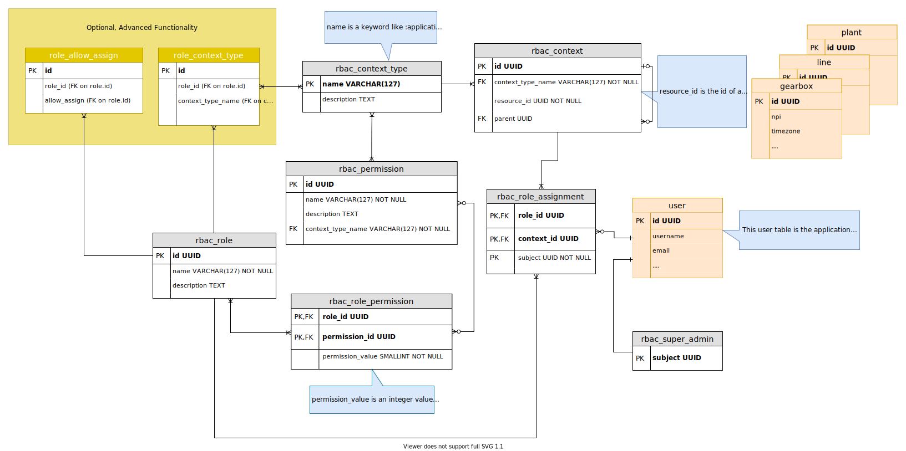

# Data Base Schema

## Status - 

## Context
The definitive schema that it will be used is represented in the next link:

In the definition of the schema, some decision were taken to adapt it into the proper context of
this library.

## Decision

1. `user` table won't exist as part of the database schema of the library. Will get the `user.id` as a foreign_key from
the existing application database.
2. If a `user.id` exists in the `rbac_super_admin` table, further checks won't be needed.
3. `rbac_role_assigments` table will relate a user, with a role in a context.
4. `rbac_context_level` table describes the different levels where resources will exist in an application, it's totally
attached to the application domain and will be pre defined.
5. `rbac_context` table will define each and every instance of the resources present in all the `rbac_context_level`s.
Level hierarchy will be defined by the `parent_id` parameter.
6. `rbac_role_permission` table will relate permits with roles.
7. Once prohibited a permission in a level, is prohibited all down the line of context_levels.
8. `rbac_permission` table relates permissions with context levels. A permission will make sense in a certain context_level
and this relation will be defined in this table.
9. By now Optional/Advanced functionality won't be developed. 

## Consequences
* `user` table will have to exist in the application.
* The application domain will define context levels, and this information will be stored into `rbac_context_level` 
table.
* Each time a new resource is inserted in the database of the application, this has to be inserted into the `rbac_context`
table with the `resource_id` reference.
 
## Notes
